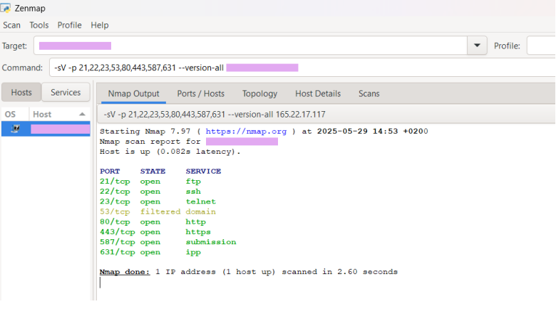
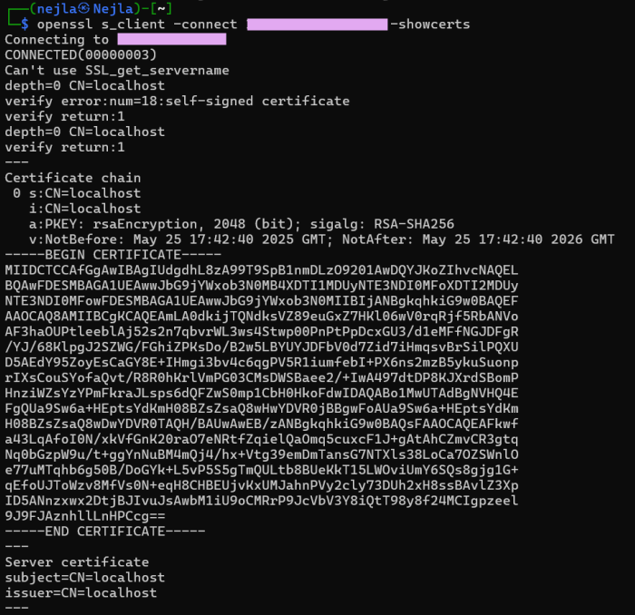
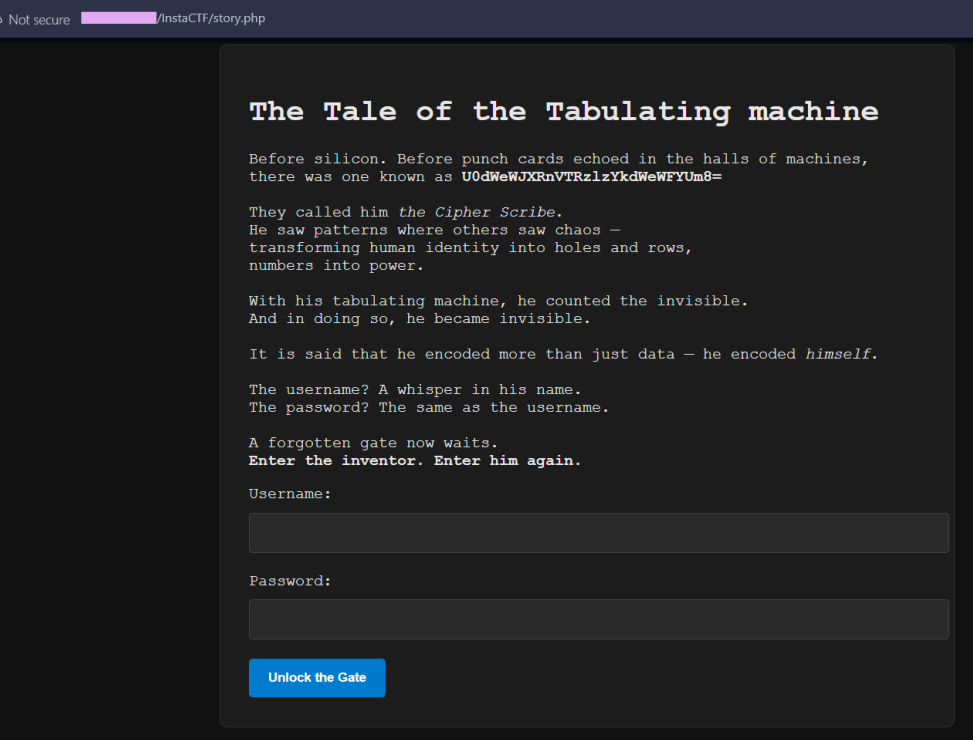
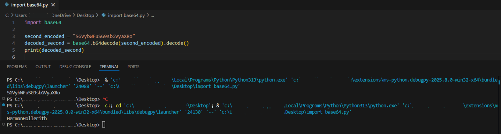
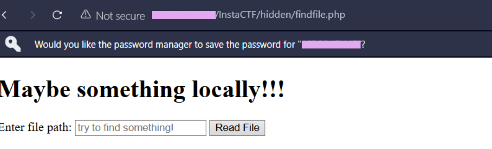
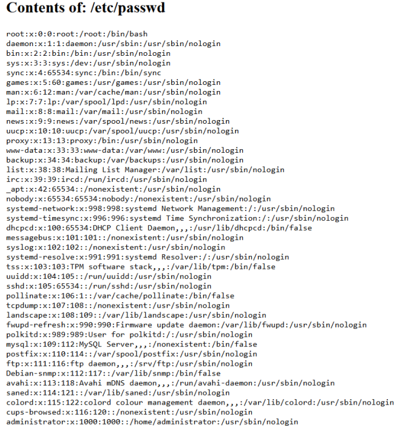
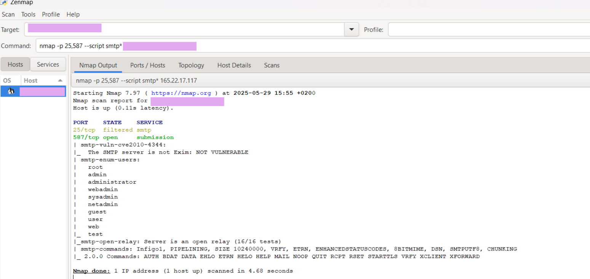
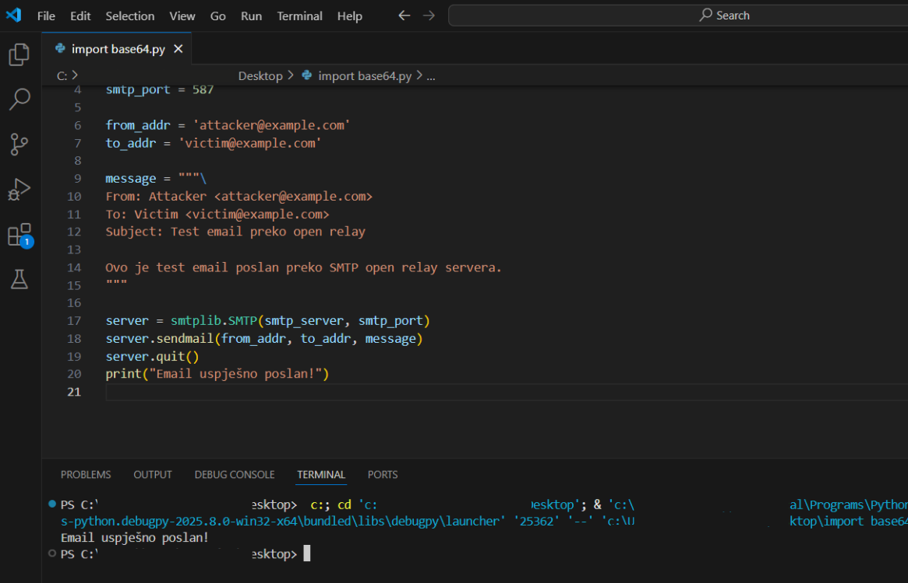

# Enterprise Web Application Security Assessment (Simulation)

## Overview

This writeup documents a web application penetration test conducted during the **FIT Coding Challenge 2025** - a cybersecurity competition where I was given a single IP address and no further instructions. Placed **3rd in the Cybersecurity Category**.

The objective was to identify security weaknesses in a corporate web application infrastructure, demonstrate potential attack paths, and propose remediation strategies aligned with industry best practices.

This repository contains a sanitized version of the assessment suitable for portfolio and educational purposes. No real client infrastructure is referenced or exposed.

---

## Assessment Scope

The simulated environment included:

- Public-facing web application with authentication system
- File handling functionality
- Mail services (SMTP)
- Network-exposed services (FTP, Telnet, SSH)

Testing simulated an external attacker with no prior access. Only an IP address was provided as a starting point.

---

## Methodology

The assessment followed a standard three-phase penetration testing workflow:

**Phase 1 - Reconnaissance**
- Port scanning and service enumeration
- Technology and version identification
- Attack surface mapping

**Phase 2 - Target Assessment**
- Manual inspection of application logic
- Authentication mechanism testing
- Input handling and injection testing

**Phase 3 - Exploitation**
- Vulnerability chaining
- Sensitive data exposure validation
- Access escalation attempts

Testing was performed in a controlled environment without service disruption.

---

## Detailed Writeup

### Phase 1 - Reconnaissance

Started with a full port scan using **Nmap (Zenmap GUI)** against the target host.

**Open ports discovered:**

| Port | Service | Notes |
|---|---|---|
| 21 | FTP | Anonymous login enabled |
| 22 | SSH | Accessible; no credential attack performed |
| 23 | Telnet | Legacy plaintext protocol exposed publicly |
| 80 | HTTP | Web application entry point |
| 443 | HTTPS | Self-signed TLS certificate detected |
| 587 | SMTP | Open relay confirmed |
| 631 | IPP | Internet Printing Protocol exposed |

The number of exposed services on a public-facing host was immediately a red flag.Particularly Telnet on port 23, which transmits all data in plaintext and has no place on a modern system.



---

### Phase 2 - Web Application Discovery

Navigated directly to the target IP in a browser and discovered a login portal at `/InstaCTF/`. The site used HTTPS but the browser flagged it as untrusted. Inspecting the certificate via OpenSSL confirmed it was self-signed and issued to `localhost` which is a misconfiguration that exposes users to man-in-the-middle attacks.

Reviewed the page source via Chrome DevTools and identified that the login form submitted credentials to `login.php`.




---

### Phase 3 - Testing for Common Vulnerabilities

Before going further, tested for the most common web vulnerabilities.

**SQL Injection** - injected `' OR 1=1 --` into the username field. The application returned "user not found" rather than bypassing authentication. DevTools inspection confirmed the backend used PDO prepared statements. SQL injection was not viable.

**XSS** - injected standard script payloads into available input fields. None executed. Input sanitization was in place.

Both attack paths were closed. Needed to look elsewhere.

---

### Phase 4 — Hidden Entry Point Discovery

Scrolling through the login page revealed a styled narrative section titled *"The Tale of the Tabulating Machine"* containing an encoded string embedded in the text.

Recognized the string as Base64 encoding and decoded it using Python:

```python
import base64
print(base64.b64decode("U0dWeWJXRnVTRzlzYkdWeWFYUm8=").decode())
# Output: HermanHollerith
```

The narrative hinted that the username and password were identical. Authenticating with `HermanHollerith` / `HermanHollerith` succeeded which confirmed the presence of a hardcoded backdoor credential embedded in the application.




---

## Phase 5 — Local File Inclusion (LFI) Exploitation

After successfully authenticating with the decoded credentials, the application redirected to a hidden page at `/InstaCTF/hidden/findfile.php` — a file reader interface accepting arbitrary file paths. This is a textbook Local File Inclusion vulnerability.



**Files successfully read:**

**`/etc/passwd`**
Exposed the full list of system users, confirming the presence of an `administrator` account with a home directory, and revealing installed services including MySQL, FTP, and Postfix.

**`/var/www/html/InstaCTF/login.php`**
Revealed the authentication logic in full. Passwords were compared in plaintext — no hashing in place. Any database leak would directly expose all user credentials without requiring any cracking.

**`/var/www/html/InstaCTF/connect.php`**
Exposed hardcoded MySQL database credentials in plaintext:

```
host: 127.0.0.1
user: [REDACTED]
pass: [REDACTED]
db:   insta_db
```


.png)

---

### Phase 6 — SMTP Open Relay Verification

Ran Nmap scripts against the mail service ports:

```bash
nmap -p 25,587 --script smtp* [TARGET]
```

Results confirmed the server was a fully open relay — accepting and forwarding mail from completely unauthenticated sources. SMTP user enumeration revealed usernames including `admin`, `administrator`, and `webadmin`.

Verified the relay manually using a Python script:

```python
import smtplib

smtp_server = "[TARGET]"
smtp_port = 587
from_addr = "attacker@example.com"
to_addr = "victim@example.com"
message = """From: Attacker <attacker@example.com>
To: Victim <victim@example.com>
Subject: Open Relay Test

Test email sent through unauthenticated SMTP relay.
"""

server = smtplib.SMTP(smtp_server, smtp_port)
server.sendmail(from_addr, to_addr, message)
server.quit()
print("Email sent successfully.")
```

Email delivered successfully without any authentication — vulnerability confirmed.




---

### Phase 7 — Anonymous FTP Access

Connected to the FTP service without credentials. Anonymous login was accepted. Directory browsing was possible, though upload permissions were restricted. While limited in direct impact, unauthenticated access to any internal directory structure represents meaningful information disclosure.

---

## Attack Chain

```
Base64-encoded backdoor credentials discovered in page narrative
                        ↓
              Authentication bypass
                        ↓
         LFI → /etc/passwd, login.php, connect.php
                        ↓
        Hardcoded database credentials exposed
                        ↓
      Plaintext password storage in backend confirmed
                        +
    Open SMTP relay → unauthenticated mail delivery confirmed
    Anonymous FTP → internal directory structure accessible
```

---

## What Didn't Work

**MySQL remote access** - credentials from `connect.php` were valid, but MySQL was bound to `127.0.0.1`, blocking all external connections. Remote database access would have required achieving RCE first, most likely through LFI log poisoning via Apache access logs, a path identified but not fully executed.
**Telnet brute force** - Telnet on port 23 was open and flagged as a significant misconfiguration, but tooling setup issues prevented completing this attack path during the competition.

---

## Key Findings Summary

| # | Finding | Severity |
|---|---|---|
| 1 | Local File Inclusion — arbitrary file read | Critical |
| 2 | Hardcoded backdoor credentials | Critical |
| 3 | Anonymous FTP access | High |
| 4 | Open SMTP relay | High |
| 5 | Plaintext password storage | Medium |
| 6 | Self-signed misconfigured HTTPS certificate | Medium |
| 7 | Apache version disclosure | Low |

---

## Security Strengths Observed

- SQL injection protections via PDO prepared statements
- XSS input sanitization in place
- FTP upload permissions restricted for anonymous users

---

## Remediation Recommendations

**Immediate:**
- Patch or isolate the LFI vulnerability - audit all file inclusion logic and implement strict allowlists
- Disable anonymous FTP access entirely
- Require SMTP authentication and disable open relay
- Remove or rotate hardcoded credentials

**Long-term:**
- Implement bcrypt or Argon2 password hashing
- Replace self-signed certificate with a trusted CA-issued certificate
- Hide server version banners
- Establish a formal vulnerability management process
- Implement security hardening baselines for all deployed services

---

## Tools Used

| Tool | Purpose |
|---|---|
| Nmap / Zenmap | Port scanning and service enumeration |
| Python (base64) | Decoding encoded application data |
| Python (smtplib) | Manual SMTP relay verification |
| FTP client | Anonymous login testing |
| Chrome DevTools | Application logic inspection |
| OpenSSL | TLS certificate analysis |
| MySQL client | Attempted database authentication |

---

## MITRE ATT&CK Mapping

| Finding | ATT&CK Tactic | Technique ID | Technique Name |
|---|---|---|---|
| Hardcoded credentials | Initial Access | T1078 | Valid Accounts |
| Plaintext password storage | Credential Access | T1552 | Unsecured Credentials |
| Local File Inclusion | Discovery | T1083 | File and Directory Discovery |
| LFI config exposure | Credential Access | T1552.001 | Credentials in Files |
| Open SMTP relay | Command and Control | T1071 | Application Layer Protocol |
| Anonymous FTP access | Collection | T1213 | Data from Information Repositories |
| Server version disclosure | Reconnaissance | T1592 | Gather Victim Host Information |

---

## Purpose of This Repository

This project demonstrates:

- Penetration testing methodology applied end-to-end
- Vulnerability identification and chaining across multiple services
- Attack path reasoning from initial reconnaissance to credential exposure
- Clear remediation planning aligned with industry standards

The environment described is a fully simulated competition setup. No real infrastructure is referenced.

---

## Author

**Nejla Hasanović** | Cybersecurity Student  
[GitHub](https://github.com/hasanovicnejla)


*FIT Coding Challenge 2025 - 3rd Place, Cybersecurity Category*


